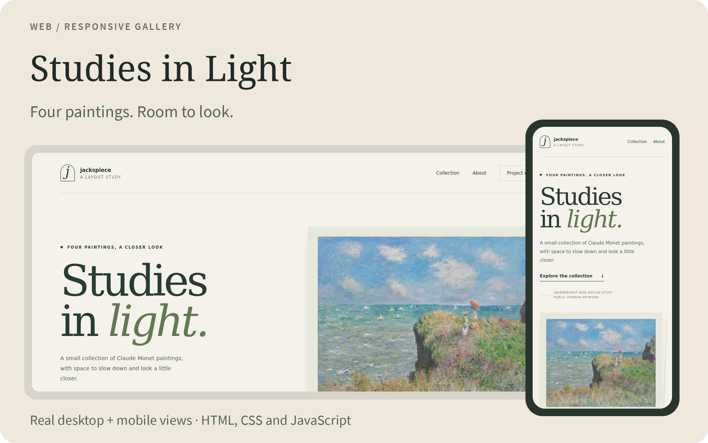

# Studies in Light

A small, responsive art gallery built with HTML, CSS and JavaScript. Four public domain paintings by Claude Monet, with room for the images and their captions.

<picture>
  <source media="(max-width: 600px)" srcset="docs/assets/overview-mobile.png">
  
</picture>

**[Open the live gallery →](https://jackspiece.github.io/gallery-layout-example/)** · [Preview locally](#preview-locally) · [Artwork credits](https://jackspiece.github.io/gallery-layout-example/credits.html)

## Take a look around

- An opening artwork leads into a staggered collection of four paintings.
- Open an artwork for a larger view; Escape closes it.
- Bookmark an artwork or use **Copy artwork link** to share that exact view. Back and Forward follow the viewer.
- The layout adapts to a narrow screen, with keyboard and touch interaction.
- Image links still work when JavaScript is disabled.

This is an independent layout study. **Web design and code: jackspiece. Paintings: Claude Monet.**

## Share an artwork

Open a painting, then choose **Copy artwork link**. If the browser cannot copy it, a selected, read-only link appears so you can copy it manually. No clipboard permission setting needs to be changed. A link opens the same painting when JavaScript and the native dialog API are available; ordinary painting links still open the image without JavaScript.

The stable fragments are `#artwork-cliff-walk`, `#artwork-water-lilies`, `#artwork-sunrise` and `#artwork-garden`. For example, after starting the local preview below, open `http://127.0.0.1:8000/#artwork-water-lilies`.

Opening a painting adds one viewer history entry. Close, Escape, a backdrop click or Back returns to the previous page section; Forward reopens that artwork. Changing the artwork within an already-open viewer replaces its current entry. Closing a pasted or reloaded artwork link removes its fragment and stays on the gallery, bringing the focused artwork into view instead of navigating to another page. Unknown fragments are left alone.

## Preview locally

No package installation or build step is needed.

```sh
git clone https://github.com/jackspiece/gallery-layout-example.git
cd gallery-layout-example
python -m http.server 8000 --bind 127.0.0.1
```

Open **http://127.0.0.1:8000/** in your browser.

## Inside the project

| File | What to find |
| --- | --- |
| [index.html](index.html) | The page structure and artwork links. |
| [styles.css](styles.css) | Typography, spacing and responsive layout. |
| [gallery.js](gallery.js) | The enlarged image view and its controls. |
| [credits.html](credits.html) | Artwork titles, dates and source links. |
| [image-credits.json](image-credits.json) | Download records, dimensions and source fingerprints. |

Images are hosted locally as WebP. The page uses system fonts and vanilla JavaScript.

## Check the interactions

Optional development checks cover deep links/history, clipboard fallback, keyboard/modal focus, close/reopen races, no-JavaScript image links, responsive layouts and local asset budgets. See [testing and performance notes](docs/testing.md) for commands, evidence and limits. The site itself still needs no build step or framework.

## Artwork and license

The paintings came from Wikimedia Commons records marked as public domain. Titles and dates were cross-checked against those records. The [credits page](credits.html) links each source.

The [MIT License](LICENSE) covers the original site code. The paintings retain the public domain designation recorded at their sources.

---

For a small website fix or layout project, [open a project enquiry](https://github.com/jackspiece/gallery-layout-example/issues/new?template=project-enquiry.md) with the page, desired change and budget. Scope, price and funding are agreed before work starts. Keep account details out of public issues.
